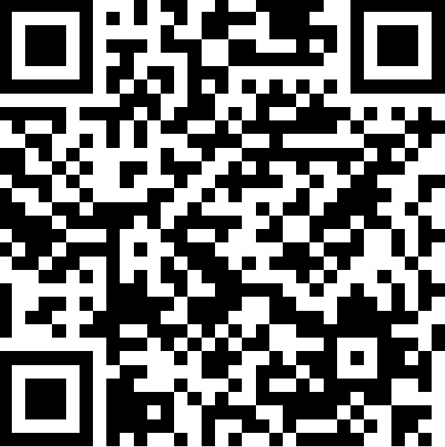

```{r setup, include=FALSE}
knitr::opts_chunk$set(
  cache = FALSE, 
  echo = TRUE,
  warning = FALSE,
  message = FALSE,
  out.width = '100%',
  res = 200,
  dev = 'jpeg')
# options(digits = 3)
options(knitr.duplicate.label = "allow")
```


```{r, include=F}
output_format <- knitr::opts_knit$get("rmarkdown.pandoc.to")
repo_url <- system("git config --get remote.origin.url", intern = TRUE)
repo_name <- sub(".git$", "", basename(repo_url))
org_name <- basename(dirname(repo_url))
rmd_filename <- tools::file_path_sans_ext(basename(knitr::current_input()))
github_pages_url_general <- paste0("https://", org_name, ".github.io/", repo_name, "/")
github_pages_url <- paste0("https://", org_name, ".github.io/", repo_name, "/", rmd_filename, ".html")
github_md_url <- paste0('https://github.com/geofis/curso-tg-junio-2025/blob/main/')
```

```{r, results='asis', echo=F}
if (grepl('gfm', output_format)) {
  cat('Versión HTML (quizá más legible), [aquí](', github_pages_url, ')\n', sep = '')
} else if (output_format == 'latex') {
  cat('Versión HTML (quizá más legible), [aquí](', github_pages_url, ')\n', sep = '')
}
```


## Código QR para acceder a este portal



***

## Objetivos del curso

1. **Comprender las bases de la fotogrametría**: Conocer los principios fundamentales que sustentan el procesamiento fotogramétrico.

2. **Conocer la normativa vigente en la República Dominicana** sobre el uso de drones en el espacio aéreo.

3. **Operar drones de manera segura y eficiente y comprender las bases del funcionamiento de los receptores GNSS aplicados a la fotogrametría**: Adquirir experiencia en el manejo de drones para la toma de imágenes aéreas y colectar puntos de control de tierra de precisión centimétrica.

4. **Procesar imágenes obtenidas con drones**: Desarrollar habilidades en la planificación, adquisición y procesamiento de imágenes fotogramétricas para la creación de productos como nubes de puntos, DSM, y DTM.

---

# Guión de las prácticas

## Práctica 1: Experimentación de la visión tridimensional

### Objetivo

Familiarizar a los estudiantes con la visualización de la tridimensionalidad a partir de imágenes aéreas, tanto con medios análogos como digitales.

### Actividades

1. **Introducción a la visión tridimensional**
    - Breve explicación sobre la percepción estereoscópica.
    - Cómo se crea la visión 3D a partir de imágenes.

2. **Experimento con estereoscopio de bolsillo**
    - Uso de imágenes aéreas tradicionales.
    - Demostración del estereoscopio de bolsillo.
    - Ejercicio práctico con imágenes aéreas que los estudiantes deben analizar en 3D.

3. **Experimento con estereoscopio de espejo**
    - Uso de estereoscopios de espejo.
    - Análisis de imágenes aéreas y comparación con los resultados obtenidos con el estereoscopio de bolsillo.

4. **Introducción a productos fotogramétricos digitales**
    - Explicación sobre la nube de puntos, DSM (Modelo Digital de Superficie) y DTM (Modelo Digital del Terreno).

5. **Visión 3D con productos fotogramétricos**
    - Visualización y manipulación de modelos 3D generados a partir de datos fotogramétricos.
    - Experiencia práctica utilizando un visualizador 3D.

---

## Práctica 2: Evaluación de la normativa dominicana

### Objetivo

Evaluar la legislación y normativas vigentes en la República Dominicana para el uso de drones en vuelos y otras actividades.

### Actividades

1. **Introducción a la normativa para el uso de drones en RD**
    - Explicación de las leyes y regulaciones nacionales relacionadas con el uso de drones.
   
2. **Análisis de las normativas dominicanas**
    - Evaluación de los aspectos legales relevantes para los estudiantes que operan drones en RD (registro de drones, permisos de vuelo, restricciones de espacio aéreo, etc.).
    - Debate sobre la importancia de la seguridad y el cumplimiento normativo.

3. **Estudio de casos prácticos**
    - Análisis de casos de vuelo de drones en RD: identificar buenas prácticas y violaciones a las normativas.
    - Discusión en grupo sobre cómo cumplir con la normativa en diversas situaciones.

---

## Práctica 3: Vuelo de drones y colecta de puntos de control de tierra con GNSS

### Objetivo

Proporcionar experiencia práctica en la operación de drones para la captura de imágenes aéreas y toma de puntos de control de tierra de precisión centimétrica.

### Actividades

1. **Introducción al vuelo de drones**
    - Explicación de los controles básicos del drone.
    - Tipos de drones y sus características.
   
2. **Preparación para el vuelo**
    - Inspección previa al vuelo del equipo (drone, batería, controles, etc.).
    - Revisión de las normas de seguridad y protocolos de vuelo.

3. **Vuelo práctico con drones**
    - Vuelo supervisado por el instructor.
    - Los estudiantes practicarán despegues, aterrizajes, y vuelos estabilizados, así como la toma de imágenes aéreas de un área específica.
    - Uso de la cámara del drone para capturar imágenes de alta calidad.

4. **Colecta de puntos de control de tierra con GNSS**
    - **Introducción al GNSS y su uso en fotogrametría**:
      - Explicación de la importancia de los puntos de control terrestre (GCPs) en la fotogrametría y cómo ayudan a mejorar la precisión de los modelos 3D generados a partir de los datos del drone.
      - Breve repaso sobre el sistema GNSS (Global Navigation Satellite System) y su funcionamiento, incluyendo la diferencia entre los sistemas RTK y PPK para obtener coordenadas precisas.
   
    - **Demostración de operación del equipo GNSS**:
      - Instrucciones sobre el uso de un receptor GNSS de precisión centimétrica (ej., Rover GNSS) para la colecta de puntos de control de tierra.
      - Configuración y calibración del receptor GNSS para capturar datos con precisión centimétrica.
   
    - **Proceso de colecta de puntos de control**:
      - Los estudiantes tomarán lecturas de coordenadas geográficas en puntos clave del área de vuelo.
      - Identificación de ubicaciones para los puntos de control, asegurando que estén distribuidos de manera adecuada en el área de interés para una correcta georreferenciación de las imágenes del drone.
   
    - **Integración con el vuelo del drone**:
      - Al finalizar la toma de imágenes del drone, se asociarán las coordenadas de los puntos de control con las imágenes capturadas para mejorar la precisión en el procesamiento posterior.

---

## Práctica 4: Planificación y procesamiento de fotografías adquiridas en vuelo

### Objetivo

Guiar a los estudiantes en la planificación de la toma de fotografías y en el procesamiento básico de imágenes adquiridas durante el vuelo del drone.

### Actividades

1. **Planificación de la misión fotogramétrica**
    - Explicación sobre la planificación de vuelos para adquirir imágenes aéreas de alta calidad.
    - Herramientas y software utilizados para planificar vuelos (ej. aplicaciones de mapas, controladores de vuelo).

2. **Procesamiento de las imágenes**
    - Introducción al procesamiento de imágenes aéreas.
    - Uso de software fotogramétrico básico para crear nubes de puntos y modelos 3D a partir de las imágenes tomadas.
    - Generación de un Modelo Digital de Superficie (DSM) y un Modelo Digital del Terreno (DTM) básicos.

3. **Discusión de los resultados y conclusiones**
    - Análisis de la calidad de los productos generados.
    - Discusión sobre las mejoras en los vuelos y las imágenes tomadas, y cómo mejorar los resultados.

---

## Enlaces de interés

- [Vuela seguro (IDAC)](https://www.idac.gob.do/drone/)

- [SIAGA Información documentada. Plataforma de acceso público a los documentos de la institución tales como: Reglamento Aeronáutico Dominicano (RAD), Resoluciones, Leyes, Manuales, Requisitos, Circulares, Formularios, Boletines, PDE y Borradores RAD, Exenciones, etc.](https://siagagestion.idac.gob.do/documentos/publico.html?t=725)

- [Guía de Estudio del Reglamento Aeronáutico Dominicano (RAD)](https://siaga.idac.gob.do/GuiaEstudio/)

## Referencias

- López Vergara, M. L. (1988). Manual de fotogeología. Centro de Investigaciones Energéticas, Medioambientales y Tecnológicas (España). https://books.google.com.do/books?id=TI7JAAAACAAJ

- Wolf, P. R., Dewitt, B. A., & Wilkinson, B. E. (2014). Elements of photogrammetry with applications in GIS (4th ed.). McGraw Hill Education.

- Olaya V. (2025). Sistemas de Información Geográfica. Libro SIG.